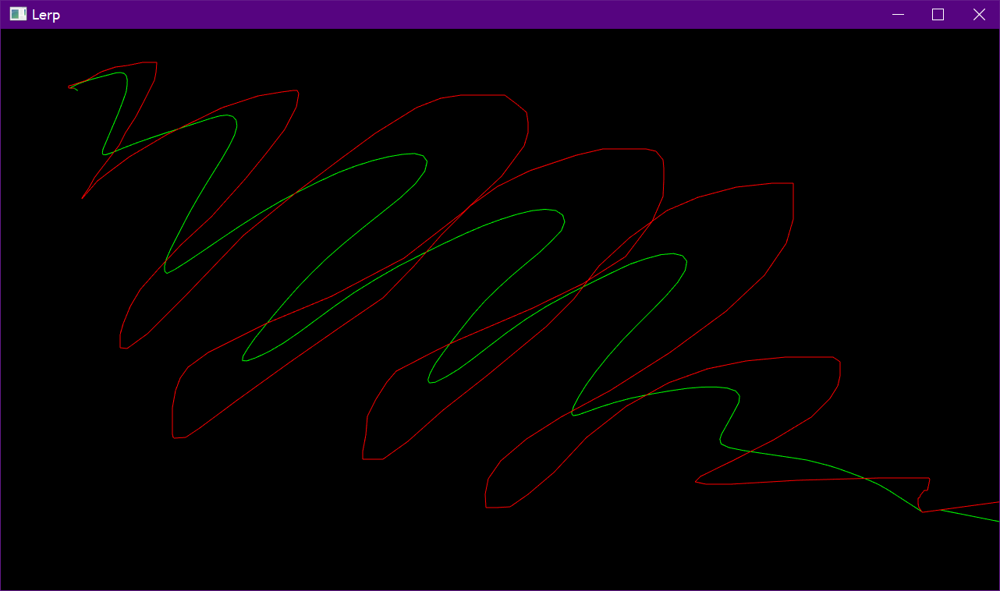

# Lerp

Performs Linear Interpolation of the mouse movement and shows the difference between the mouse path (colored in red) and interpolated path (colored in green).

## Built With

- [SFML](https://www.sfml-dev.org/)

## Screenshots

